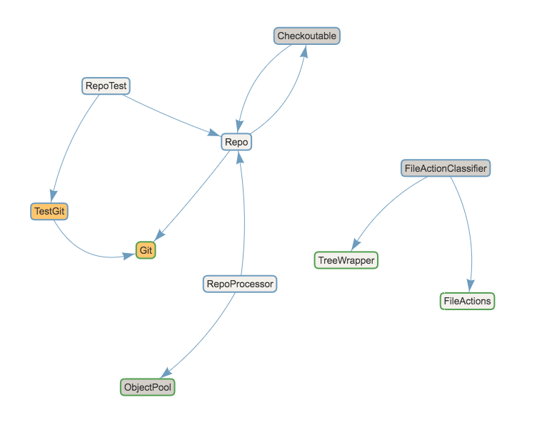

# Class Dependency Grapher

Usage:

1. Build a jar: `lein uberjar`
2. Clone a repo to examine
3. Run the analyser: `java -jar dependency-analyser.jar $REPO_PATH $FILE_EXT`

`FILE_EXT` should be the extension(s) used for code in the project. They should define classes with capital letters and use a `class` keyword.

